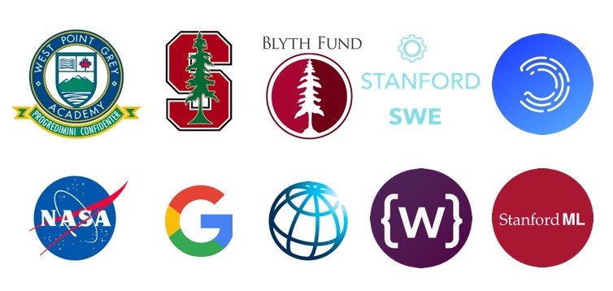

I'm a **Junior @ [Stanford](https://profiles.stanford.edu/eva-zhang)**, currently pursuing interests in mathematics, computer science, and tech. policy. Formally, I'm coterming in Computer Science (AI track), and intending to major in Mathematics.

Here are some places I've spent some time at. 

I've lived in Vancouver, Canada, Shanghai, China, and most recently Stanford, USA. **Things I'm prioritizing learning more about in 2020:** 

- algorithmic policy, especially regulatory trends on fairness
- large-scale healthcare digitization 
- digital infrastructure, trends in education in developing economies 

Courses I've enjoyed at Stanford include *Group Theory, Biodesign Ventures, Energy Policy, Deep Generative Models, Philosophy of Love, Neurodegeneration and Intracellular Trafficking, Stochastic Processes*, and *Computer Systems & Networking*. 

In a past life, I have spent a sizable amount of time travelling for Model UN and debate. Arguing with people have given me useful practice for defending my questionable (or so I have been told) [music](https://open.spotify.com/user/evazhung?si=zAJdV4WNRiWQr3CUW8qswQ) and productivity habits in college. I'm not putting these on the Internet for fear of reader retaliation, happy to chat more offline. 

I'm currently working on a few projects for 2020. When choosing work, I prioritize people and amount of learning (which is often linked to the people). 

Websites are great, but there's always something special about chatting in person. I always find it refreshing to hear new perspectives - feel free to reach out by email! 