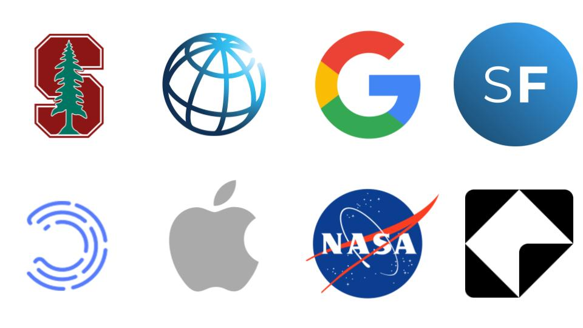

A social media experiment without ads or wallets, starting with web3. 

We start by solving the social discovery and curation problem for web3 users. 

Part of a new social network without ads, where users create2Earn. 

<h1>Waitlist Signup</h1>

<form action="https://getform.io/f/96389641-994a-4df5-9214-495fe8dd4497" method="POST">
    <input type="text" name="name"  placeholder="Your Name">
    <input type="email" name="email" placeholder="Email Address">
    <button type="submit">Send It</button>
</form>

<!-- 
I am currently part of a team experimenting with new ways of powering up social networks. 

If you are interested in helping build out our experiment, particularly if you are someone interested in software engineering, growth, or tokenomics, reach out! See more via the <a href="build" data-toggle="tooltip" data-original-title="{{site.build}}">build</a> page. 

I'm a **Master's student @ [Stanford](https://profiles.stanford.edu/eva-zhang)**, currently pursuing interests in mathematics, computer science, and tech. policy. Formally, I am pursuing a Master's in Computer Science (AI track), and completed a Bachelor's in Mathematics. Check out my [Build](https://www.evazhang.com/build) page for more specific technical experiences.

I studied Mathematics (B.S) and Computer Science (M.S) at <a href="courses" data-toggle="tooltip" data-original-title="{{site.courses}}">Stanford</a>. Here are some places and communities I've spent some time at. 

 -->

<!-- I've lived in Vancouver, Canada, Shanghai, China, and most recently Stanford, USA. 
 -->
<!-- **Things I'm prioritizing learning more about in 2020:** 

- algorithmic policy, especially regulatory trends on fairness
- large-scale healthcare digitization 
- digital infrastructure, trends in education in developing economies --> 
<!-- 
Courses I've enjoyed at Stanford include *Groups & Rings, Biodesign Ventures, Energy Policy, Deep Generative Models, Philosophy of Love, Neurodegeneration and Intracellular Trafficking, Stochastic Processes*, and *Computer Systems & Networking*.  -->

<!-- In a past life, I have spent a sizable amount of time travelling for Model UN and debate. Arguing with people has given me useful practice for defending my questionable (or so I have been told) [music](https://open.spotify.com/user/evazhung?si=zAJdV4WNRiWQr3CUW8qswQ) and productivity habits in college. I'm not putting these on the Internet for fear of reader retaliation, happy to chat more offline.  -->

<!-- I'm currently working on a few projects for 2021. I would especially love to chat if you are interested in or have experience in algorithmic policy and AI fairness & interpretability.  -->

<!-- When choosing work, I prioritize learning. -->

<!-- You can find my [substack](https://evaz.substack.com) below. If you wanted to check out a sample, here's my most recent [post](https://twitter.com/newsycombinator/status/1349990374899646464) (trended Top 3 on HackerNew's front page for a bit). 

    <iframe src="https://evaz.substack.com/embed" width="480" height="200" style="border:0px solid #EEE; background:white;" frameborder="0" scrolling="no"></iframe>

 --> 

<!-- You can leave anonymous feedback for me, good or bad,[here 💭](https://www.evazhang.com/feedback/). Hearing new perspectives is always refreshing - feel free to reach out to me by email! 

I've recently started a [substack](https://evaz.substack.com) to document my thoughts more in 2021. Websites are great, but there's always something special about chatting in person (read: Zoom, for now).  -->

<!-- I always find it refreshing to hear new perspectives - feel free to reach out by email! You can also leave anonymous feedback for me [here 💭](https://www.evazhang.com/feedback/).  -->

<!-- Adding click fn code for counter --> 
<!--  -->
<!-- Ending click counter. --> 

<!-- 
Note: if you saw this via a Google ad - I'm doing a small AB experiment on search results for fun. Click the below to vote on whether you saw my website through an ad. -->

